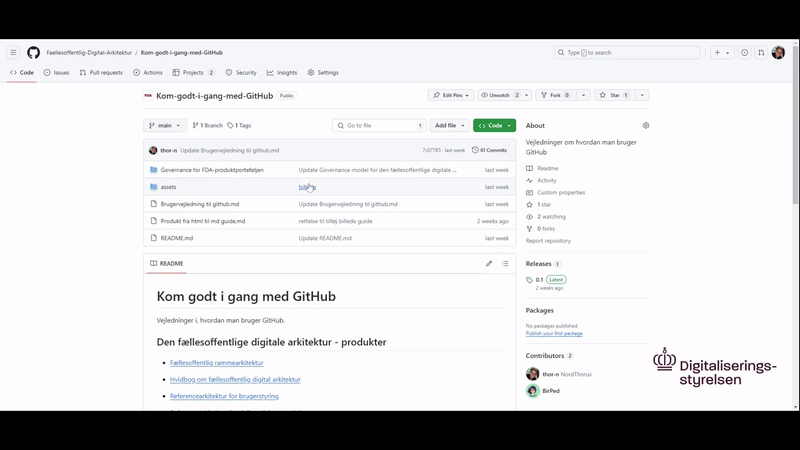
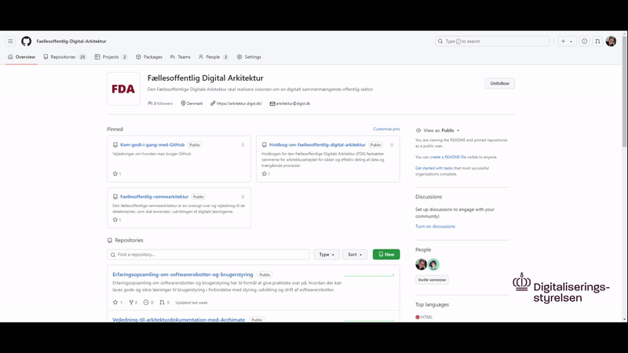
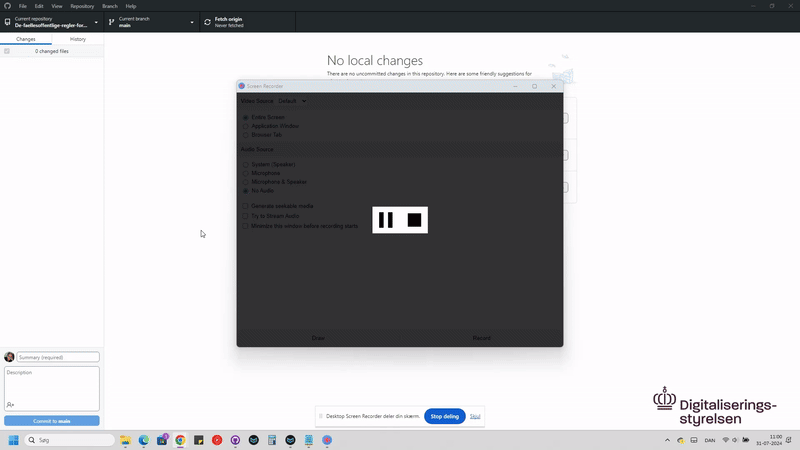
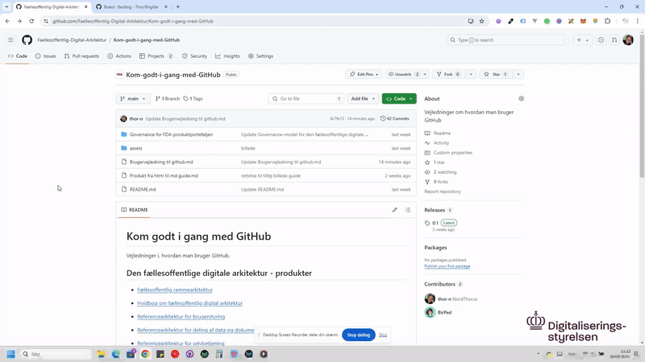
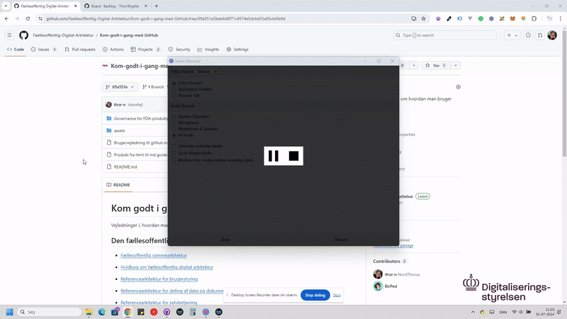

# Brugervejledning til github

## Værktøjer

**Github desktop**Bruges til at få sine ændringer op til github og hente nyeste version (installer)
[https://desktop.github.com/]([https://desktop.github.com/](https://desktop.github.com/))

**MarkText** Brugervenlig måde at lave overskrifter, tabeller m.m. ala word program til markdown, gratis program (installer)
[https://www.marktext.cc/](https://www.marktext.cc/)

**Github.com** (Til merge, issues + evt. wiki (howto guides) + projects til opgaver og issues med forskellige views )
[Github.com](https://github.com)

**Html-to-markdown** (Tag en del af en html fil og Konverter til markdown, men der er noget som skal justeres efterfølgende (fx. billeder, links).
[https://htmlmarkdown.com]([https://htmlmarkdown.com](https://htmlmarkdown.com))

**Word fil til markdown** - Konverter fra word til markdown
[https://mconverter.eu/convert/docx/md/](https://mconverter.eu/convert/docx/md/)

## Guides

### Invitation til repository

Start med at få github brugernavn$ $på den eller dem som skal inviteres

1. **Gå til dit repository**:
   
   - Log ind på GitHub.
   
   - Gå til det repository, hvor du
     vil invitere en ny bruger.  

2. **Gå til 'Settings'**:
   
   - Klik på 'Settings' øverst til
     højre i dit repository.  

3. **Gå til 'Collaborators and teams'**:
   
   - Klik på knappen 'Invite people'  

4. **Find brugere**:
   
   - Skriv brugernavnet eller
     e-mailadressen på den person, du vil invitere.
   
   - Klik på 'Select a member above' 
     Husk at vælge rolle til personen 

5. **Send invitationen**:
   
   - Den inviterede person vil modtage
     en e-mail med en invitation til at blive bidragsyder til dit
     repository.
   
   - Når personen accepterer invitationen, vil de få adgang til
     dit repository afhængigt af den rolle, du har tildelt dem.
- **Husk**  
  For at kunne invitere andre til et repository,
  skal du have de nødvendige rettigheder (typisk som ejer eller
  administrator af repositoryet).  

- Bruger skal minimum have
  write tilladelse for at push til main repo. Alle kan lave et pull
  request som en admin så kan tage stilling til

- Inden man går igang med ændringer på et produkt/fil så lav en fetch/pull i github desktop så man har den nyeste version lokalt.

[](https://github.com/Faellesoffentlig-Digital-Arkitektur/Kom-godt-i-gang-med-GitHub/raw/main/assets/videoguides/Invitation%20til%20repository.mp4)

### Hvordan opretter man et nyt produkt

1. Gå ind på github.com -> vælg din organisaition -> Klik repositories -> Klik "new repository"

2. Udfyld "Repository name"

3. Vælg privat eller public (public hvis man er klar til at offentligøre produktet og har filerne klar, privat hvis man endnu ikke vil dele offentligt )

4. Check af "Add a README file"

5. Tryk "Create Repository"

6. Tildel nu rettigheder til andre brugere, hvis der er behov for det under settings

7. Evt. udfyld informationer i readme filen, ved at redigere filen på github.com eller via github desktop.

8. For at tilføje indhold på det nye produkt så følg guiden "Hvordan Lægges produkt rettelser på github" men hvor du først opretter en fil kald FILNAVN.md + en assets folder til billeder i roden af github folderen

[](https://github.com/Faellesoffentlig-Digital-Arkitektur/Kom-godt-i-gang-med-GitHub/raw/main/assets/videoguides/Hvordan%20opretter%20man%20et%20nyt%20produkt.mp4)

### Markdown editor (MarkText)

#### Rediger markdown fil i MarkText

1. Åben MarkText og klik oppe i venstre hjørne (3 strejer)

2. Klik "File" og "Open folder" vælg github mappen (lavet i github desktop) til det repository som du skal rette i.

3. Der kommer en menu i venstre side af MarkText hvor du kan vælge filen

4. Når filen er åben kan du lave dine rettelser, når du klikker på en linie vil der komme et ikon ude til venstre for linien, der kan du ændre til overskrifter, lists, m.m. Hvis du markere noget tekst kommer der en menu over med muligheder (bold, link m.m.) **INFO:** Indholdsfortegnelse laves ud fra Overskrifter "H1,H2 etc."

5. Tabeller: For at oprette en tabel skal man trykke "CmdOrCtrl +Shift+T""

6. Afslut med at save "ctrl+s" og derefter gå ind i programmet github desktop og commit+push

[](https://github.com/Faellesoffentlig-Digital-Arkitektur/Kom-godt-i-gang-med-GitHub/raw/main/assets/videoguides/Markdown%20editor%20(MarkText).mp4)

### Hent produkt repository til egen computer

1. Åben Github desktop hvor du er logget ind med din bruger 

2. Vælg add og clone og vælg fra listen, hvis du ikke er tilføjet som admin eller writer på et repository så skal du på github i det repository som du vil arbejde i, vælge "Code" og kopier linket i til github desktop (Add->clone>url)

[](https://github.com/Faellesoffentlig-Digital-Arkitektur/Kom-godt-i-gang-med-GitHub/raw/main/assets/videoguides/Hent%20produkt%20repository%20til%20egen%20computer.mp4)

#### Tilføj billeder, ved nyt produkt eller rediger produkt (VIGTIGT)

1. Oppe i venstre hjørne klik på de 3 streger og vælg "File" - > Preferences -> image
2. Under Default action.. Vælg: "Copy image to designated relative assets or global local folder"
3. Klik "Prefer relative assets folder" som den er sat til (grøn).
4. Drag 'n' drop nu billeder fra assets folderen til de steder hvor der mangler billeder

Merge og håndtering af konflikter

### Hvordan Lægges produkt rettelser på github

#### Opret ny branch (hvis ikke admin)

Hvis du ikke er admin men Contributor (Bidragyder) så skal du oprette en branch (gren med dine ændringer) som du kan push til det repository hvor ændringer skal tilføjes og produkt ansvarlig så vil tage stilling til om ens ændringer kan merges med main :

##### Trin 1: Åbn GitHub Desktop

1. Åbn GitHub Desktop-applikationen på din computer.

##### Trin 2: Vælg dit repository

1. Sørg for, at du har valgt det repository, hvor du vil oprette en ny branch. Du kan vælge dit repository fra dropdown-menuen øverst til venstre.

##### Trin 3: Opret en ny branch

1. Klik på dropdown-menuen, der viser den aktuelle branch (som regel “main” eller “master”) øverst midt i applikationen.
2. Klik på "New Branch".

##### Trin 4: Navngiv din branch

1. I pop-up vinduet, der kommer frem, skal du indtaste navnet på den nye branch.
2. Vælg, hvilken branch du vil forgrene fra (som regel vil det være "main" eller "master").
3. Klik på "Create Branch".

##### Trin 5: Skift til den nye branch

1. Efter at have oprettet den nye branch, vil GitHub Desktop automatisk skifte til den nye branch.
2. Du kan nu begynde at arbejde på denne nye branch.
3. Når du har lavet ændringer og gemt åben github desktop og skriv en commit besked nede til venstre og klik commit og derefter push (står i midten)
4. Når det er gjort følg guide "Merge branches ved hjælp af GitHub.com"

#### Push to main (direkte til offentligt produktet - admin)

Hvis du er admin og ikke skal lave en branch før du pusher dine ændringer så er det nemt med Github desktop. Tryk commit nede til venstre med en besked og push kommer frem i midten

[](https://github.com/Faellesoffentlig-Digital-Arkitektur/Kom-godt-i-gang-med-GitHub/raw/main/assets/videoguides/Hvordan%20L%C3%A6gges%20produkt%20rettelser%20p%C3%A5%20github.mp4)

#### Merge (flet filer sammen)

##### Merge branches ved hjælp af GitHub Desktop:

###### Trin-for-trin vejledning

1. **Åbn GitHub Desktop** og sørg for, at du har
   klonet det repository, du vil arbejde på.

2. **Vælg den branch**, du ønsker at merge
   ændringerne til. Dette er typisk `main` eller en anden primær branch. Du kan vælge branch i øverste
   venstre hjørne af GitHub Desktop-vinduet.

3. **Klik på "Branch"** i menulinjen og
   vælg derefter "Merge into current branch...".

4. **Vælg den branch**, du vil merge fra, i den
   liste, der vises. Dette vil typisk være den feature branch, du har
   arbejdet på.

5. **Klik på "Merge [branch name] into [current
   branch]"**. GitHub Desktop vil nu forsøge at merge
   ændringerne.

##### Merge branches ved hjælp af GitHub.com:

1. **Naviger til dit repository**: Åbn GitHub.com og gå til det repository, hvor du ønsker at merge branches.

2. **Gå til "Pull requests"**: Klik på fanen "Pull requests" øverst i menuen. Her kan du se alle åbne og lukkede pull requests.

3. **Opret en ny pull request**: Klik på knappen "New pull request". Du vil nu blive præsenteret for en skærm, hvor du kan vælge dine branches.

4. **Vælg basen og sammenfletningsbrancher**:
   
   - **Base branch**: Dette er den branch, du ønsker at merge dine ændringer ind i (ofte `main` eller `master`).
   - **Compare branch**: Dette er den branch, hvor dine ændringer er (den du ønsker at merge fra).

5. **Gennemgå ændringer**: GitHub viser nu en oversigt over ændringerne, der vil blive lavet, når du merger. Tag dig tid til at gennemgå dem og sikre dig, at alt ser korrekt ud.

6. **Opret pull request**: Klik på knappen "Create pull request". Her kan du tilføje en titel og en beskrivelse for pull requesten, hvilket kan hjælpe med at kommunikere, hvad der bliver ændret og hvorfor.

7. **Få feedback og gennemgå**: Hvis du arbejder sammen med et team, kan du nu få feedback. Andre bidragsydere kan kommentere og anmode om ændringer. Når alle er tilfredse med ændringerne, kan pull requesten blive godkendt.

8. **Merge pull request**: Når pull requesten er godkendt og klar til at blive merged, klik på knappen "Merge pull request". Bekræft handlingen ved at klikke på "Confirm merge". Dette vil integrere de ændringer, der er lavet i din sammenfletningsbranch, ind i basebranchen.

9. **Slet branch (valgfrit)**: Efter merge kan du vælge at slette den oprindelige branch, hvis den ikke længere er nødvendig. Dette gøres normalt via en knap, der vises efter du har merged.

10. **Synkroniser dit lokale repository**: Husk at opdatere dit lokale repository med de nyeste ændringer ved at køre `git pull`

### Håndtering af merge konflikter

Hvis der opstår merge-konflikter, vil GitHub Desktop informere
dig om det. Du kan så åbne den konfliktfyldte fil ved at klikke på
filnavnet i GitHub Desktop og manuelt rette konflikten ved at vælge
hvilke ændringer der skal beholdes.

1. **Klik på den konfliktfyldte fil** i listen
   over konflikter.

2. **Rediger filen** for at løse konflikten. Dette
   kan gøres direkte i GitHub Desktop eller ved at åbne filen i din
   foretrukne teksteditor.

3. Når konflikten er løst, **marker konflikten som løst** i GitHub Desktop ved at klikke på "Mark as resolved".

4. **Commit de løste konflikter** ved at skrive en
   commit-besked og klikke på "Commit merge".

### Sådan Konfigurerer du Krav om Review før Merge

1. **Log ind på GitHub**: Gå til [GitHub](https://github.com) og log ind på din konto.

2. **Naviger til dit Repository**:
   
   - Gå til det repository, hvor du vil konfigurere branch protection rules.

3. **Gå til Repository-Indstillinger**:
   
   - Klik på fanen "Settings" øverst til højre på repository-siden.

4. **Find Branches-sektionen**:
   
   - Klik på "Branches" i menuen til venstre under sektionen "Code and automation".

5. **Opret eller Rediger Branch Protection Rules**:
   
   - Under sektionen "Branch protection rules", klik på "Add classic branch protection rule" for at oprette en ny regel eller "Edit" ved siden af en eksisterende regel, hvis du allerede har en regel, du vil ændre.

6. **Konfigurer Regelindstillinger**:
   
   - I feltet "Branch name pattern", indtast navnet på den branch, du vil beskytte. For eksempel, for at beskytte `main` branch, skriv `main`.

7. **Aktivér Review Krav**:
   
   - Under sektionen "Require pull request reviews before merging", marker boksen "Require pull request reviews before merging".
   - Du kan vælge yderligere indstillinger:
     - **Required approving reviewers**: Angiv, hvor mange godkendende reviews der er nødvendige, før en pull request kan merges.
     - **Dismiss stale pull request approvals when new commits are pushed**: Kræver, at godkendelser af pull requests bliver fjernet, hvis der tilføjes nye commits.
     - **Require review from Code Owners**: Hvis du har konfigureret produkt ejer i dit repository, kan du kræve, at en produkt ejer skal godkende ændringer.

8. **Gem Ændringerne**:
   
   - Klik på "Crete" eller "Save changes" for at anvende dine branch protection regler.

#### Eksempler på Regelindstillinger

- **"Require pull request reviews before merging"**: Hvis du markerer denne mulighed, kræves det, at alle pull requests skal gennemgås og godkendes af en eller flere reviewers, før de kan merges.
- **"Required approving reviewers"**: Hvis du sætter dette til 2, kræves det, at 2 personer skal godkende pull requesten, før den kan merges.

**Overvejelser**

- **Branch Protection Rules** gælder kun for grene, der matcher det angivne mønster. Sørg for at konfigurere regler for alle vigtige grene, såsom `main` eller `develop`, afhængigt af din arbejdsproces.
- **Code Owners**: Hvis du har specificerede code owners, kan du kræve, at deres godkendelse er nødvendig, hvilket er nyttigt for teams, hvor bestemte medlemmer er ansvarlige for specifikke områder af koden.

Ved at konfigurere disse regler kan du sikre, at alle ændringer gennemgås af relevante teammedlemmer, hvilket hjælper med at opretholde høj kodekvalitet og samarbejde i dit projekt.

#### Administrator - med eller uden ekstra reviewer indstilling

En administrator kan normalt review sin egen pull request, hvis man klikker "Do not allow bypassing the above settings" så skal admins pull request over i review hos en anden bruger

### Hvordan oprettes tags og releases.

**(LINK TIL Release procedure for produkter)**

At lave tags i GitHub Desktop og oprette en release i GitHub.com
er en to-trins proces, der involverer både det lokale GitHub
Desktop-program og den online GitHub.com-tjeneste. Her er en trinvis
vejledning:

#### Opret et tag i GitHub Desktop

1. **Åbn GitHub Desktop**:
   
   - Start GitHub Desktop og åbn det
     repository, hvor du vil oprette et tag.

2. **Opret et tag**:
   
   - Commit din ændring hvor der er
     skal laves en ny release
   
   - Klik på History
   
   - Højre på din release
   
   - Klik på `Create tag`
   
   - Indtast tag-navnet (f.eks., `v1.``3`)
     og en besked, hvis det er nødvendigt.
   
   - Klik på `Create Tag`.

3. **Synkroniser dine ændringer**:
   
   - Klik på `Push origin` for at
     sende dit nye tag til GitHub repository.

#### Opret en release i GitHub.com

1. **Åbn dit repository på GitHub.com**:
   
   - Gå til GitHub.com og naviger til
     dit repository.

2. **Opret en ny release**:
   
   - Klik på `Releases` sektionen i højre menu eller naviger til
     `https://github.com/<dit-brugernavn>/<dit-repository>/releases`.
   
   - Klik på `Draft a new release` knappen.

3. **Udfyld release oplysninger**:
   
   - Under `Tag version`, vælg det tag, du lige har oprettet i GitHub
     Desktop.
- Indtast en titel for din release
   (f.eks., `Version v1.``3`).

- Skriv en beskrivelse af
   ændringerne i denne release. Du kan inkludere ændringer,
   forbedringer, eller fejlrettelser, som er inkluderet i denne
   version.  
2. **Publicer releasen**:
   
   - Når alle oplysninger er udfyldt, klik på `Publish release` knappen.

[](https://github.com/Faellesoffentlig-Digital-Arkitektur/Kom-godt-i-gang-med-GitHub/raw/main/assets/videoguides/Hvordan%20oprettes%20tags%20og%20releases.mp4)

### Issues og krydshenvisninger guide

Hvordan bruges issue-funktionen i GitHub i public repositories
· Den interne proces – fra issue til rettelse
· Notifikation vedr. issues

#### Issues

Når et nyt issue oprettes på GitHub, kan forskellige brugere modtage notifikationer baseret på deres involvering og indstillinger. Her er en oversigt over, hvem der typisk får notifikationer:

1. **Repository Ejer og Collaborators**: Alle, der har write eller administrativ adgang til repository, vil som standard modtage notifikationer om nye issues, medmindre de specifikt har slået dem fra.

2. **Watchers**: Brugere, der har valgt at "watch" repository, vil modtage notifikationer om alle aktiviteter, herunder nye issues. Der er forskellige niveauer af watching:
   
   - **Watching**: Modtager notifikationer om alle aktiviteter.
   - **Not watching**: Modtager kun notifikationer, når de bliver nævnt direkte eller involveret i en tråd.
   - **Ignoring**: Modtager ingen notifikationer overhovedet.

3. **Nævnte Brugere**: Hvis en bruger bliver nævnt i et issue ved hjælp af @-mention (f.eks. @username), vil denne bruger få en notifikation.

4. **Tidligere Deltagere**: Brugere, der tidligere har deltaget i en tråd (f.eks. kommenteret på et tidligere issue eller pull request), vil typisk modtage notifikationer om nye kommentarer eller ændringer.

5. **Team Mention**: Hvis et helt team nævnes (f.eks. @org/team-name), vil alle medlemmer af dette team modtage en notifikation.

Indstillinger for notifikationer kan tilpasses af den enkelte bruger i deres GitHub-indstillinger, hvor de kan vælge præferencer for, hvordan og hvornår de vil modtage notifikationer.

#### krydshenvisninger

For at lave en krydshenvisning til en issue, pull request eller commit på
GitHub, kan du bruge deres nummer eller hash, som følger:

- **Issues:** Brug `#` efterfulgt af issue-nummeret.
  
  ```
  Se issue #42 for mere information.
  ```

- **Pull Requests:** Brug `#` efterfulgt af pull request-nummeret.
  
  ```
  Dette løser problemet beskrevet i pull request #123.
  ```

- **Commits:** Brug `@` efterfulgt af commit-hashen.
  
  ```
  Dette problem blev løst i commit @abcdef.
  ```

#### Krydshenvisninger til tekstlokationer i Markdown-filer

Hvis du vil krydshenvise til en specifik placering i en
Markdown-fil, som f.eks. en bestemt sektion, en tabel, eller en
kodeblok:

**Tekstlokation:**

På github naviger ind på en fil som du skal henvise til og gøre som på billedet


Indsæt derefter i din kommentar, nye issue eller andre steder på github

[](https://github.com/Faellesoffentlig-Digital-Arkitektur/Kom-godt-i-gang-med-GitHub/raw/main/assets/videoguides/Krydshenvisninger%20til%20bestemt%20tekst%20i%20en%20linje.mp4)

#### Krydshenvisninger i Kommentarer og Pull

Disse krydshenvisninger fungerer i kommentarer, issues, pull
requests og pull request-beskrivelser på GitHub. Når du bruger
disse links, vil GitHub automatisk generere et klikbart link til det
pågældende issue, pull request eller fillokation.

**Eksempel på Krydshenvisning**

Her er et eksempel på, hvordan du ville oprette en
krydshenvisning i en GitHub Issue til en specifik linje i en
Markdown-fil:

```
Jeg har fundet et problem på [linje 15 i README.md](https://github.com/brugernavn/repository/blob/main/README.md#L15). Kan nogen tage et kig?
```

Når dette er skrevet i en GitHub Issue eller en anden kommentar, vil
det generere et link, der direkte fører læseren til den pågældende
linje i README.md-filen.

Ved at bruge disse krydshenvisningsmetoder kan du effektivt
forbinde forskellige elementer og filer på GitHub, hvilket gør det
lettere for brugerne at navigere og finde relevant information.

#### Ændre e-mail notifikationer på et repository

- Naviger til det repository, hvor du ønsker at ændre notifikationsindstillingerne.

- Klik på pilen til højre for unwatch

 

### Hvordan sletter man en commit ved hjælp af github desktop

#### 1. Åbn GitHub Desktop

For at slette en tidligere commit i GitHub Desktop skal du følge disse trin:

1. Åbn GitHub Desktop.
2. Klik på fanen “Historik” i venstre sidepanel.
3. Højreklik på den commit, du vil slette vælg “Revert changes in commit ”
4. Commit og push 

**Bemærk**, at når du sletter en tidligere commit, oprettes der også en ny commit, der fjerner ændringerne fra den valgte commit.

Hvis du ønsker at annullere ændringerne fra en bestemt commit, er dette den rigtige fremgangsmåde. 

### Hvordan finder man gamle versioner af et produkt (releases)

- Naviger til det repository, hvor du ønsker at finde en anden version .

- Klik på pilen til højre for main

- Klik Tags

- klik på den version (release) som du skal bruge


### Projekter

#### Tildel et issue til et projekt på GitHub

1. Efter at have oprettet dit issue, vil du se det nye issue på listen. Klik på issue-titlen for at åbne det.
2. I højre side under "Projects", klik på "Projects" dropdown-menuen.
3. Vælg det projekt, du vil tildele issue til. Hvis der ikke er nogen projekter tilgængelige, skal du først oprette et projekt.

#### Oprettelse af et Projekt (hvis nødvendigt)

1. Gå til din repository's hovedside.
2. Klik på "Projects" fanen.
3. Klik på "New project".
4. Udfyld detaljer som projektnavn og beskrivelse.
5. Klik på "Create project".

#### Hvordan assigner man en til et issue/draft på et projekt

1. Gå til din repository's hovedside.

2. Klik på "Projects" fanen.

3. Klik på det projekt hvor du skal assign en personen

4. Klik på det issue/draft hvor du skal assign en person

5. Klik ude til højre på "Add assignees" og vælg den eller de personener som skal på opgaven (den/de vil få en mail med en notifikation)

**Info:** Draft betyder at opgaven ikke er fra issues men oprettet under projektet og ikke konverteret til et issue. Draft bruges til alle andre typer opgaver om ikke har noget med  issues at gøre.

#### Sådan opretter man kategori boksen

*Bruges fx. til at kategorisere todos fx. produkt, videoguide etc.*

1. Gå til dit projekt

2. Klik på de 3 prikker oppet til højre

3. Klik "setting"

4. Under Custom fields klik "New field" skriv kategori navn og vælg fx. Text i dropdownen

5. Du kan nu skrive en kategori tekst i dit nye felt i projekt opgaver.

6. INFO: Du kan drag''n'drop dine opgaver som du vil når du laver egne custom fields, 

### Projekter FAQ

- Projekter kan tilføjes til et repository og de kan gøres private eller offentlige (folk kan se hvordan issues prioteres)

- Når der er issues kan man knytte et issue til et projekt og på den måde bedre holde styr på hvor issue er i processen. (gøres ude til højre på et issue)

- Man kan tilføje forskellige label m.m. til en opgave/issue. Man kan tilføje nye hvis man klikker på de 3 prikker ude til højre på et projekt, derefter -> settings -> + New field (Der kan du vælge flere typer, hvis man vil have en tekst labels så vælg text og de kan sorteres, hvis du vælger numre så kan man ikke drag'n'drop som man har lyst til i todos)

### FAQ

#### Hvad betyder Fetch

- Henter ændringer uden at integrere dem.

- Ingen risiko for at ændre dit lokale arbejde.

- Bruges til at se, hvad der er ændret i fjernrepoen, før du integrerer disse ændringer.

#### Hvad betyder Pull

- Henter og integrerer ændringer i én handling.

- Kombinerer fjernrepoens ændringer med dit lokale arbejde, hvilket kan føre til konflikter, hvis der er modstridende ændringer.

- Bruges til at sikre, at din lokale kopi er opdateret med de nyeste ændringer fra fjernrepoen.

#### Hvad er merge

- **Opret en pull request:** Anmod om at flette ændringer fra din gren til en anden gren.
- **Gennemgang:** Andre teammedlemmer ser på dine ændringer og godkender dem.
- **Fletning (merge):** Når ændringerne er godkendt, bliver de kombineret med målgrenen.

#### Github desktop hvad sker der hvis man laver en pull og der er en ændring på en fil, som man kun har ændret i lokalt

Når du laver en pull i GitHub Desktop og der er ændringer i en fil, som du også har ændret lokalt, vil Git forsøge at fusionere de ændringer. Her er hvad der typisk sker i dette scenarie:

1. **Automatisk Fusionering (Merge)**:
   
   - Hvis ændringerne i den samme fil er i forskellige dele (linjer) af filen, vil Git automatisk fusionere disse ændringer. Dette betyder, at både dine lokale ændringer og de ændringer, der blev hentet fra fjernlageret (remote), vil blive bevaret.

2. **Kombination af Ændringer (Merge Conflict)**:
   
   - Hvis ændringerne er i de samme linjer af filen, vil Git ikke kunne foretage en automatisk fusionering. Dette resulterer i en fusionskonflikt (merge conflict). Git vil markere konflikten i filen og du bliver nødt til at løse denne konflikt manuelt. GitHub Desktop vil hjælpe dig ved at vise konflikten og give dig mulighed for at vælge, hvordan konflikten skal løses.

**Sådan håndteres en merge conflict i GitHub Desktop:**

1. **Når konflikten opstår**, vil GitHub Desktop vise en besked om, at der er opstået en konflikt og vil give dig mulighed for at se de konfliktramte filer.

2. **Åbn filen med konflikten**: Du vil se sektioner markeret som:
   
   `<<<<<<< HEAD 
   
   Dine lokale ændringer
   =======
   
   Ændringer fra fjernlageret 

> > > > > > > branch-name`

3. **Løs konflikten** ved at redigere filen manuelt. Fjern konfliktsmarkørerne (<<<<<<, =======, >>>>>>) og vælg hvilken ændring du vil beholde eller kombiner begge ændringer på en meningsfuld måde.

4. **Når konflikten er løst**, gem filen og gå tilbage til GitHub Desktop.

5. **Markér konflikten som løst**: GitHub Desktop vil give dig mulighed for at markere konflikten som løst.

6. **Udfør en commit** af de ændringer, der blev lavet for at løse konflikten.

7. **Push de ændringer** tilbage til fjernlageret (remote repository).
